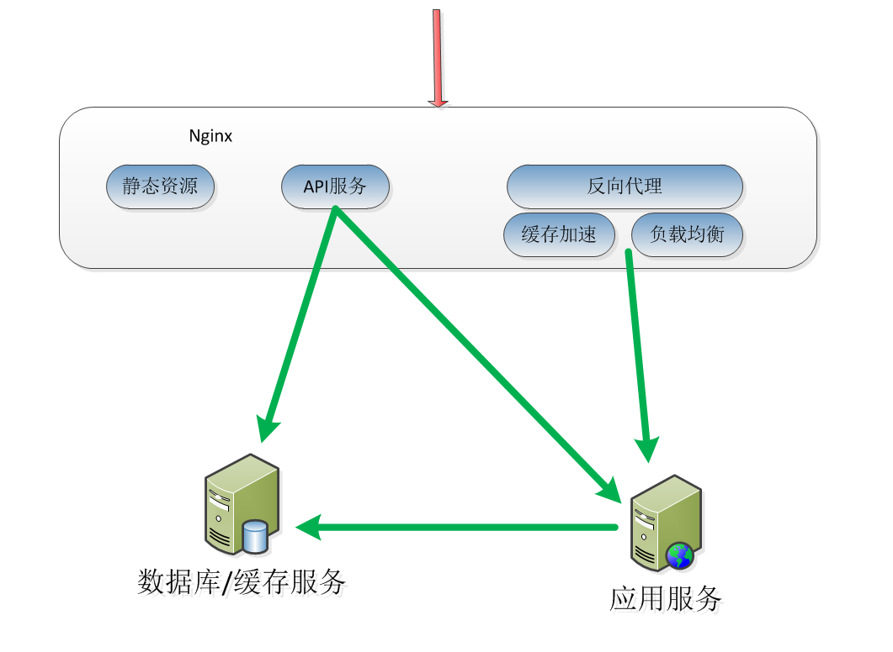

#Nginx简介
##主流的Web服务器
* Nginx
* Apache
* Tomcat
##Nginx优点
* 高并发，高性能
* 可扩展性好
* 高可靠性
* 热部署
* BSD许可

##Nginx三个主要应用场景
* 静态资源服务
    * 通过本地文件系统提供服务
* 反向代理服务
    * Nginx的强大性能
    * 缓存
    * 负载均衡
* API服务
    * OpenResty


##Nginx的组成
* Nginx二进制可执行文件
* Nginx.conf配置文件
* access.log访问日志
* error.log错误日志

##Nginx目录结构
```html
nginx-1.14.2
├── auto (辅助configure执行时判断操作系统特性以及包含哪些模块)
│   ├── cc
│   ├── lib
│   │   ├── geoip
│   │   ├── google-perftools
│   │   ├── libatomic
│   │   ├── libgd
│   │   ├── libxslt
│   │   ├── openssl
│   │   ├── pcre
│   │   ├── perl
│   │   └── zlib
│   ├── os
│   └── types
├── conf （配置文件的示例文件）
├── contrib (vim颜色工具 cp -r contrib/vim/* ~/.vim/ 会高亮显示nginx配置文件语法)
│   ├── unicode2nginx
│   └── vim
│       ├── ftdetect
│       ├── ftplugin
│       ├── indent
│       └── syntax
├── html (包含2个标准的html，欢迎和500错误)
├── man （帮助文件）
└── src （源码文件）
    ├── core
    ├── event
    │   └── modules
    ├── http
    │   ├── modules
    │   │   └── perl
    │   └── v2
    ├── mail
    ├── misc
    ├── os
    │   └── unix
    └── stream
```
##编译Nginx
1. 编译参数分为4类：(./configure --help)
    * (1) 辅助类参数 (--prefix等)
    * (2) 确定使用或不使用哪些模块
        * with (默认不会编译进nginx)
        * without （默认会编译到nginx中，加次参数会移除该模块）
    * (3) gcc参数、第三方模块、debug参数等
2. 执行configure： ./configure --prefix=/home/dream/nginx
3. 执行完第2步之后会在当前目录下生成objs目录
    ```$xslt
    objs/
    ├── autoconf.err
    ├── Makefile
    ├── ngx_auto_config.h
    ├── ngx_auto_headers.h
    ├── ngx_modules.c (说明nginx包含哪些模块)
    └── src
        ├── core
        ├── event
        │   └── modules
        ├── http
        │   ├── modules
        │   │   └── perl
        │   └── v2
        ├── mail
        ├── misc
        ├── os
        │   ├── unix
        │   └── win32
        └── stream
    ```
4. 执行make
    * 目标二进制文件nginx会放到objs目录下
    * 中间文件也会在objs目录下生成
5. 执行make install，会将编译后的nginx拷贝到prefix指定的目录中
```$xslt
nginx
├── conf
├── html
├── logs
└── sbin
```

##Nginx配置文件语法
1. 配置文件由指令与指令块构成
2. 每条指令已;分号结尾，指令与参数之间以空格分隔
3. 指令块以{}大括号将多条指令组织在一起
4. include允许组织多个配置文件以提升可维护性
5. 使用#添加注释，提高可读性
6. 使用$符号使用变量
7. 部分指令参数支持正则表达式

###参数
#### 时间单位
* ms（毫秒）
* s（秒）
* m（分钟）
* h（小时）
* d（天）
* w（星期）
* M（月）
* y（年）
#### 空间单位
* 默认 bytes(B)
* k/K kilobytes(KB)
* m/M megabytes(MB)
* g/G gigabytes(GB)

## Nginx 命令行
1. 格式 nginx -s reload
2. 帮助： -? -h
3. 使用指定配置文件：-c
4. 指定配置指令： -g
5. 指定运行目录：-p
6. 发送信号：-s
    * stop 立即停止服务
    * quit 优雅的停止服务
    * reload 重载配置文件
    * reopen 重新开始记录日志文件
7. 测试配置文件是否有语法错误： -t -T
8. 打印nginx的版本信息、编译信息等： -v -V

### 热部署
1. 替换nginx二进制文件
2. kill -USR2 $pid(当前nginx master进程)
    * 这时候会新启动一个nginx master进程（同时会存在2个master进程）
    * 所有请求会平滑过渡到新的master进程下的worder进程
3. kill -WINCH $pid（老的master进程同2中的pid）
    * 老的worker进程都退出了，但是老的master进程还在
    * 老的master进程不会主动退出，允许做版本回退
### 切割日志
1. mv access.log bak.log (备份)
2. nginx -s reopen （重新生成access.log）
3. 切割日志脚本
    * crontab任务：0 0 1 * * root /usr/local/nginx/logs/rotate.sh
    ```jshelllanguage
    #!/bin/bash
    LOGS_PATH=/usr/local/nginx/logs/history
    CUR_LOGS_PATH=/usr/local/nginx/logs
    YESTERDAY=$(date -d "yesterday" +%Y-%m-%d)
    mv ${CUR_LOGS_PATH}/access.log ${LOGS_PATH}/access_${YESTERDAY}.log
    mv ${CUR_LOGS_PATH}/error.log ${LOGS_PATH}/error_${YESTERDAY}.log
    #向Nginx主进程发送USR1信号。USR1信号是重新打开日志文件
    kill -USR1 $(cat /usr/local/nginx/logs/nginx.pid)
    ```
###