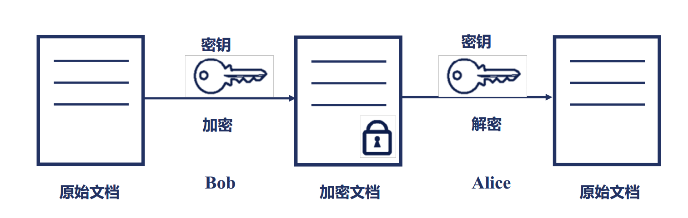
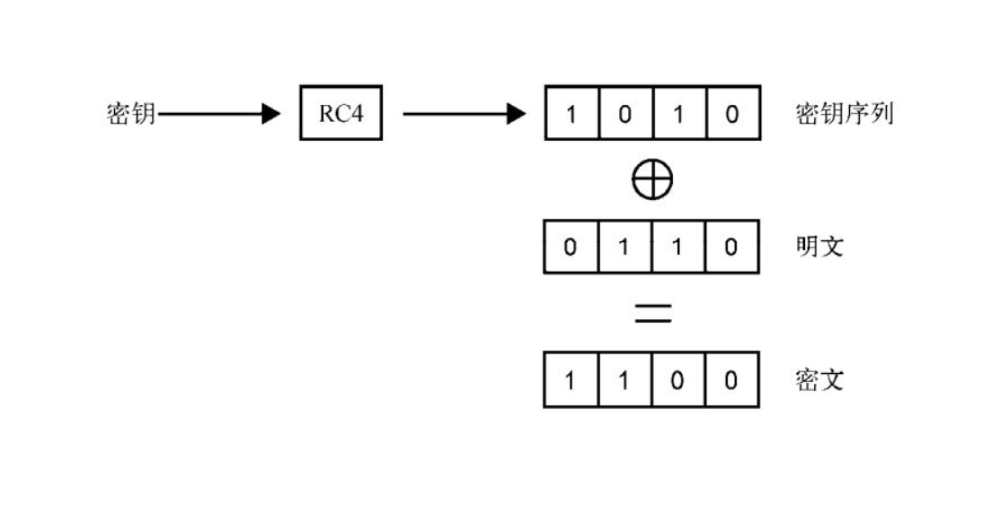
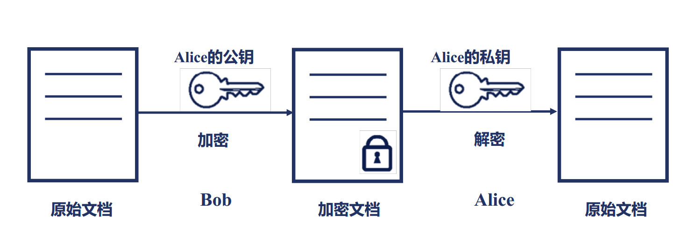
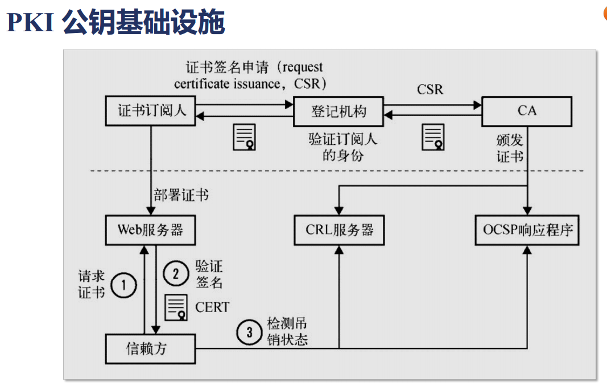
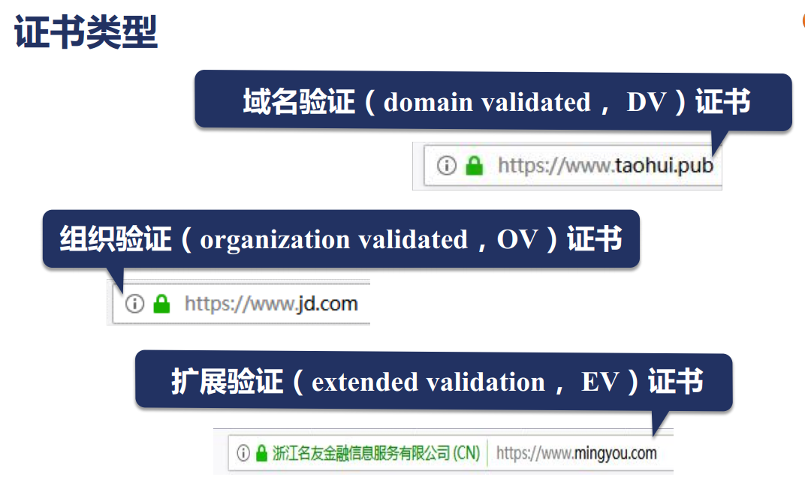
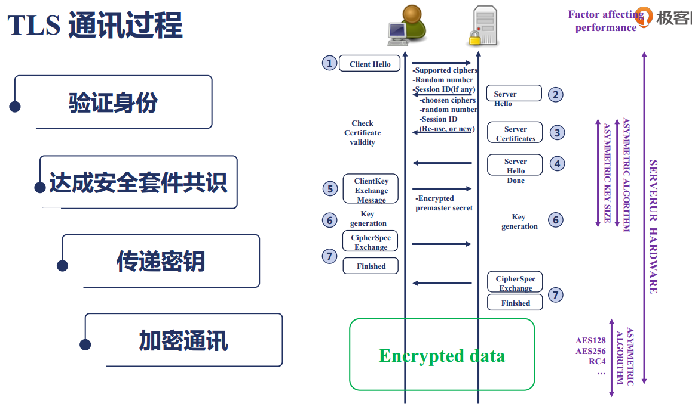

# 15 对称加密与非对称加密各自的应用场景
* 对称加密

* 非对称加密

# 16 SSL 证书的公信力是如何保证的
* PKI 公钥基础设施

* 证书类型
    * DV（domain validated）域名验证证书    ——最便宜的证书，甚至免费
    * OV（organization validated）组织验证证书 ——申请时间长，且更贵
    * EV（extended validated）扩展验证证书  ——验证更严格

* 证书链
    * 根证书 —— 二级证书 —— 主证书

# 17 SSL 协议握手时Nginx的性能瓶颈在哪里
* TLS 通讯过程

1. 浏览器(client)向服务器(server)发送Client Hello消息，告诉server,client（当前浏览器）支持哪些加密算法
2. server有自己的一套加密套件列表，nginx选择其中一套加密套件发送给client，
如果nginx打开了session_cache，希望在一天内断开连接的client不用再次协商密钥，则可以复用之前的密钥
3. server将公钥证书发送给client,此公钥证书中包含证书链，因此浏览器可以找到自己的根证书库去验证证书是否有效
4. server向client发送Server Hello Done，在3、4步之间将椭圆曲线算法的参数发送给client，
以便在第6步生成密钥
5. client根据椭圆曲线的公共参数生成自己的私钥，然后将公钥发送给server。
6. 
    * 6.1 server可以根据自己的私钥和client的公钥共同生成双方加密的密钥
    * 6.2 client根据server的公钥和自己的私钥也生成一个密钥
    * 6.1 和 6.2 生成的密钥是相同的（这是由非对称加密算法(比如RSA)保证的）
7. 用6中生成的密钥加密数据，进行通讯

* Nginx握手性能
    * 对于小文件，握手是影响性能的主要指标，主要考虑非对称加密的性能
    * 对于大文件，主要考虑对称加密AES算法的性能

